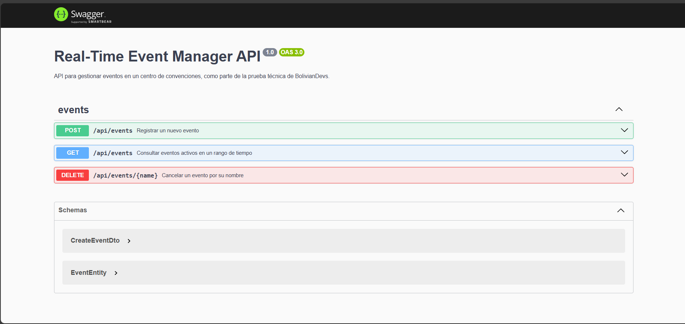

# Gestor de Eventos en Tiempo Real - Prueba Técnica BolivianDevs

Este repositorio contiene la solución a la prueba técnica para el puesto de desarrollo web, propuesta por [BolivianDevs](https://boliviandevs.com). El objetivo es un sistema para gestionar eventos en tiempo real en un centro de convenciones.

## 🔗 Despliegue en Vivo (Producción)

La API está desplegada y puede ser probada en vivo en el siguiente enlace:

**[Ver API en Vivo](https://events.solution-services-tech.com/api)**




## Descripción del Problema

Una empresa organiza eventos en diferentes salones de un centro de convenciones. La lógica de negocio principal se rige por las siguientes reglas:

- Cada salón solo puede albergar un evento a la vez, pero eventos en diferentes salones pueden superponerse en el tiempo.
- Los eventos tienen un nombre, un salón asignado, una hora de inicio y una hora de finalización.

El sistema debe permitir las siguientes operaciones:

1.  **Registrar nuevos eventos**, asegurando que no haya superposiciones en el mismo salón.
2.  **Consultar qué eventos están activos** en un rango de tiempo determinado, en cualquier salón.
3.  **Cancelar un evento** por su nombre.

### Escenario de Ejemplo

> Supongamos que tienes 3 salones e intentas registrar los siguientes eventos:
> 
> - Evento A: Salón 1, 09:00-11:00
> - Evento B: Salón 1, 10:30-12:00 (debería ser rechazado por superposición)
> - Evento C: Salón 2, 10:00-11:30
>
> Luego, se consulta los eventos activos entre las 10:00 y las 10:45.

## Solución Propuesta

La solución es una **API RESTful** construida con **NestJS** que expone endpoints para gestionar los eventos. La API está completamente documentada de forma interactiva con **Swagger (OpenAPI)**, lo que facilita su exploración y prueba.

### Tecnologías Utilizadas

- **Framework:** NestJS (TypeScript)
- **Pruebas:** Jest
- **Documentación de API:** Swagger (OpenAPI)
- **Validación:** class-validator, class-transformer

## Cómo Ejecutar el Proyecto

### Prerrequisitos

- Node.js (v20 o superior recomendado)
- npm

### Pasos

1.  **Clonar el repositorio:**

    ```bash
    git clone <URL-del-repositorio>
    cd <nombre-del-repositorio>
    ```

1.  **Copiar el archivo `.env.example` y renombrarlo a `.env`:**

    ```bash
    cp .env.example .env
    ```

3.  **Instalar dependencias:**

    ```bash
    npm install
    ```

4.  **Ejecutar la aplicación en modo de desarrollo:**

    ```bash
    npm run start:dev
    ```

    La aplicación estará disponible en `http://localhost:3000`.

5.  **Ejecutar las pruebas unitarias:**
    Para verificar la integridad de la lógica de negocio, puedes correr las pruebas unitarias:
    ```bash
    npm run test
    ```

## Uso de la API

Una vez que la aplicación esté en ejecución, la forma más fácil de interactuar con la API es a través de su documentación interactiva de Swagger.

**Abre tu navegador y ve a: `http://localhost:3000/api`**

Desde esta interfaz podrás:

- Desplegar cada endpoint para ver su descripción, parámetros y posibles respuestas.
- Utilizar el botón "Try it out" para enviar peticiones reales a la API y ver los resultados en vivo.

## Decisiones de Diseño y Arquitectura

La solución fue diseñada pensando en la claridad, extensibilidad y eficiencia, como se pedía en los requisitos.

### 1. Framework y Arquitectura (NestJS)

Elegí **NestJS** porque su arquitectura modular y el uso de patrones como la Inyección de Dependencias facilitan la creación de un sistema **extensible y mantenible**. La separación de responsabilidades en Controladores, Servicios y Módulos permite un código limpio y fácil de probar.

### 2. Patrón Repositorio y Almacenamiento

- **Patrón Repositorio:** Para desacoplar la lógica de negocio del almacenamiento de datos, implementé el Patrón Repositorio. El `EventsService` depende de una abstracción (`EventRepository`), no de una implementación concreta. Esto hace que el sistema sea extremadamente flexible y extensible.
- **Almacenamiento en Memoria:** Para esta prueba, opté por un repositorio en memoria. Es **extremadamente eficiente** para la escala requerida ("cientos de eventos") y elimina la necesidad de una base de datos externa, simplificando la ejecución del proyecto para el evaluador. Si en el futuro se necesitara persistencia, solo se crearía un nuevo repositorio (ej. `PostgresEventRepository`) y se cambiaría una línea en el `EventsModule`, sin tocar la lógica de negocio.

### 3. Manejo de Fechas (Formato ISO 8601)

Observé que los ejemplos usaban un formato de hora simplificado (`HH:mm`). Sin embargo, para un sistema robusto y sin ambigüedades, la API utiliza el **estándar ISO 8601** (`YYYY-MM-DDTHH:mm:ss.sssZ`). Esto garantiza:

- **Cero Ambigüedad:** Al usar UTC, se eliminan por completo los errores relacionados con las zonas horarias.
- **Funcionalidad Real:** Permite agendar eventos para cualquier fecha, manejando correctamente casos como eventos que cruzan la medianoche.
- **Extensibilidad:** Un sistema que maneja fechas completas desde el principio es verdaderamente extensible a futuros requisitos.

### 4. Unicidad del Nombre del Evento

El requisito de "cancelar un evento por su nombre" introduce una ambigüedad si los nombres no son únicos. Para resolver esto, tomé la decisión de diseño de **tratar el nombre del evento como un identificador único**. El sistema valida que no se pueda registrar un nuevo evento con un nombre que ya existe, garantizando que la operación de cancelación sea predecible y segura.

## Cumplimiento de Requisitos

A continuación se detalla cómo la solución cumple con cada uno de los requisitos solicitados:

- **Registrar nuevos eventos:** Implementado en el endpoint `POST /events` con validación de superposición de tiempo en el mismo salón y unicidad de nombre.
- **Consultar eventos activos:** Implementado en el endpoint `GET /events` que acepta un rango de tiempo.
- **Cancelar un evento por su nombre:** Implementado en el endpoint `DELETE /events/:name`.
- **Sistema extensible:** Logrado a través de la arquitectura de NestJS y el Patrón Repositorio.
- **Manejo de casos límite:** La lógica en `EventsService` y las pruebas unitarias cubren superposiciones, eventos consecutivos y nombres duplicados.
- **Sistema eficiente:** El uso de almacenamiento en memoria con un `Map` para acceso rápido es óptimo para la escala definida.
- **Pruebas unitarias:** El archivo `events.service.spec.ts` contiene tests para los escenarios principales y casos límite.
- **Justificación de decisiones:** Este mismo archivo README documenta y justifica todas las decisiones de diseño y arquitectura.
